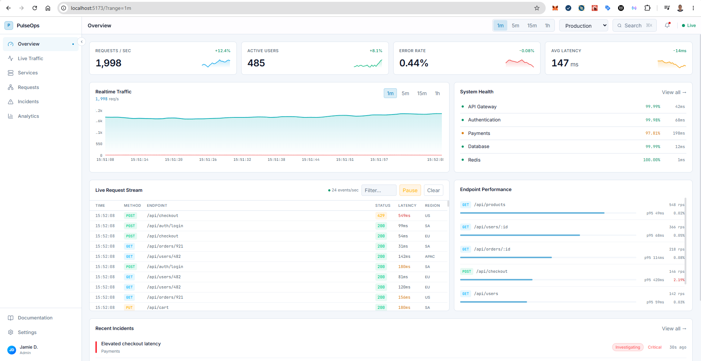
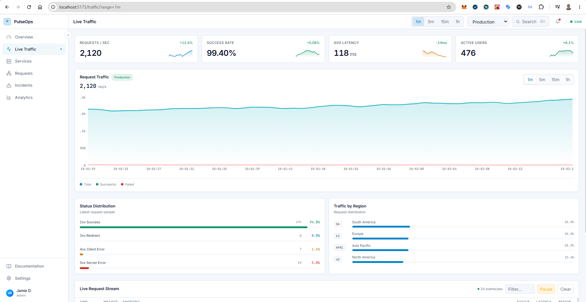
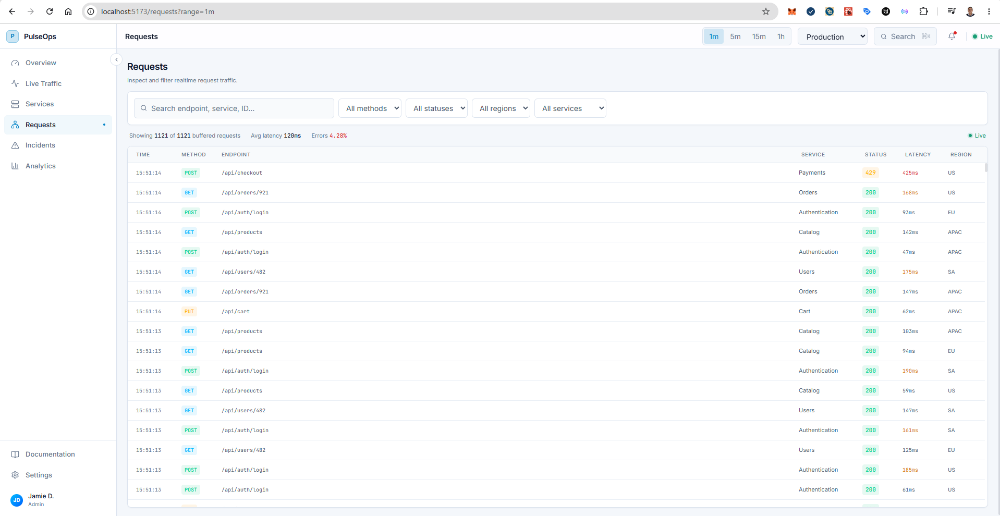
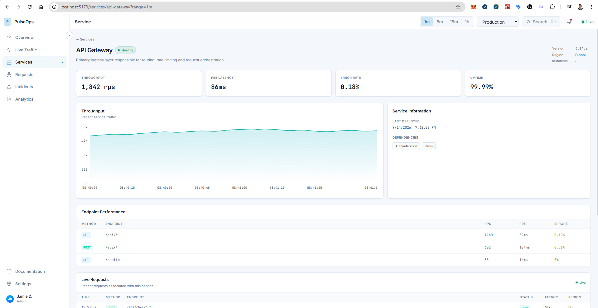
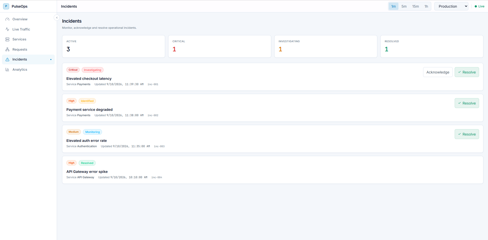
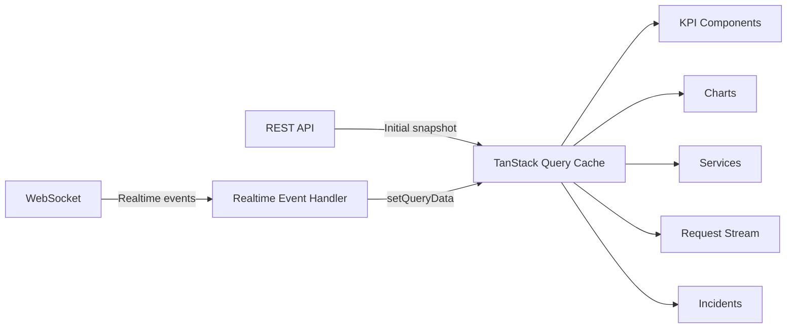

# PulseOps

**Real-time operations dashboard built with React, TypeScript, TanStack Query and WebSockets.**

PulseOps is a frontend-focused monitoring application designed to demonstrate production-style React architecture beyond standard CRUD dashboards.

It combines an initial REST snapshot with continuous WebSocket events, synchronizes realtime updates directly into the TanStack Query cache, isolates high-frequency renders, virtualizes large request streams, persists dashboard state in the URL, and implements optimistic incident mutations with targeted rollback.

---

## Highlights

* Real-time monitoring through native WebSockets
* REST + WebSocket hybrid data architecture
* TanStack Query as the shared server-state cache
* Query-cache updates through `queryClient.setQueryData()`
* Selector-based subscriptions for render isolation
* 5,000-event request buffer
* TanStack Virtual for high-frequency request streams
* URL-synchronized filters and dashboard state
* Parameterized service-detail queries
* Optimistic incident mutations with precise rollback
* Responsive desktop and mobile dashboard
* Recharts data visualizations
* Vitest integration/unit tests
* Playwright end-to-end browser tests
* Automated GitHub Actions CI

---

## Screenshots

### Overview



### Live Traffic



### Request Explorer



### Service Detail



### Incidents



---

## Architecture

PulseOps separates initial/historical data retrieval from realtime updates.



The React application does not maintain a second copy of server state for realtime data.

Instead, WebSocket events update the existing TanStack Query cache:

```text
REST
  ↓
Initial monitoring snapshot
  ↓
TanStack Query cache
  ↓
React UI

WebSocket
  ↓
Realtime event
  ↓
queryClient.setQueryData()
  ↓
same TanStack Query cache
  ↓
React UI
```

This keeps REST responses, realtime events and React consumers operating against one source of truth.

---

## Realtime Event Flow

The server emits typed realtime events such as:

```text
kpi.updated
chart.point
request.created
service.updated
incident.updated
```

The client validates each event before applying it to the monitoring cache.

Example:

```text
request.created
      ↓
WebSocket
      ↓
useRealtimeMonitoring()
      ↓
applyOverviewEvent()
      ↓
queryClient.setQueryData()
      ↓
Request subscribers update
```

The realtime connection includes:

* connection-state tracking
* offline detection
* automatic reconnection
* exponential reconnect delay
* StrictMode-safe cleanup

---

## Render Isolation

A realtime dashboard can receive many updates per second.

Subscribing the entire page to one large monitoring object would cause unrelated components to rerender every time a request arrives.

PulseOps instead uses multiple observers over the same query cache:

```text
Overview cache
   │
   ├── KPI selector
   ├── Chart selector
   ├── Services selector
   ├── Requests selector
   ├── Endpoint selector
   └── Incidents selector
```

For example:

```text
request.created
      ↓
requests reference changes
      ↓
Request Stream rerenders

KPI reference unchanged
      ↓
KPI components stay isolated
```

This allows high-frequency request updates without forcing the entire dashboard to rerender.

---

## High-Frequency Request Stream

The simulator generates a continuous stream of request events.

PulseOps retains up to:

```text
5,000 requests
```

in the client monitoring cache.

Rendering thousands of rows directly would create unnecessary DOM work, so the request explorer uses **TanStack Virtual**.

```text
5,000 logical request records
          ↓
TanStack Virtual
          ↓
only visible + overscan rows
          ↓
small DOM footprint
```

The virtualization behavior is verified in a real Chromium browser with Playwright rather than relying on JSDOM layout behavior.

---

## Request Explorer

The `/requests` route provides realtime request investigation.

Available filters include:

* free-text search
* HTTP method
* HTTP status family
* region
* service

Filters are synchronized with the browser URL.

Example:

```text
/requests?range=1h&env=staging&method=POST&status=5xx&region=EU
```

This makes application state:

* bookmarkable
* reload-safe
* shareable
* compatible with browser back/forward navigation

Selecting a request also places its identifier in the URL:

```text
/requests?request=<request-id>
```

and opens the request inspection drawer.

---

## Dashboard URL State

Global dashboard controls also use URL state.

Examples:

```text
/
```

means:

```text
range = 5m
environment = production
```

Non-default state is represented explicitly:

```text
/?range=1h&env=staging
```

Navigation preserves these parameters across routes:

```text
/?range=1h&env=staging

→ /services?range=1h&env=staging

→ /services/payments?range=1h&env=staging
```

Defaults are omitted from the URL to keep links clean.

---

## Services

The Services area demonstrates both realtime collection views and parameterized REST queries.

### Service list

The list subscribes to the realtime service slice of the main monitoring cache.

### Service detail

Individual services use dedicated TanStack Query keys:

```text
["services", "detail", "payments"]
["services", "detail", "authentication"]
["services", "detail", "redis"]
```

Example route:

```text
/services/payments
```

The detail page includes:

* service health
* throughput
* P95 latency
* error rate
* uptime
* dependencies
* endpoint performance
* traffic history
* service-specific realtime requests

`service.updated` WebSocket events can update both the main monitoring cache and an already-loaded service-detail cache.

---

## Optimistic Incident Management

Incidents can be acknowledged or resolved.

The UI updates immediately using TanStack Query's mutation lifecycle:

```text
User clicks Resolve
        ↓
onMutate()
        ↓
UI updates immediately
        ↓
PATCH /api/incidents/:id
        ↓
server confirms
```

If the request fails:

```text
Optimistic update
        ↓
API failure
        ↓
onError()
        ↓
incident rolls back
```

### Targeted rollback

PulseOps deliberately does **not** restore the entire previous monitoring snapshot.

WebSocket updates may arrive while the HTTP mutation is pending.

For example:

```text
12:00:00 Resolve incident
12:00:01 New realtime requests arrive
12:00:02 Incident mutation fails
```

Restoring the complete old snapshot would incorrectly delete the new realtime events.

Instead, PulseOps stores and restores only the affected incident:

```text
incident state → rollback
new realtime requests → preserved
new KPI values → preserved
new chart points → preserved
```

This interaction is covered by both unit tests and Playwright E2E tests.

---

## Analytics

The Analytics page derives operational metrics from the current monitoring window.

It includes:

* average throughput
* peak throughput
* success rate
* weighted P95 latency
* traffic trends
* service throughput comparison
* service latency ranking
* endpoint analytics

Aggregation is implemented in pure TypeScript utilities so calculations remain independent from React and easy to test.

The current implementation intentionally treats analytics as a rolling monitoring sample.

URL values such as:

```text
?range=1h
```

do not pretend to represent persisted one-hour historical data until a real historical backend exists.

---

## Technology Stack

### Frontend

* React
* TypeScript
* Vite
* React Router
* TanStack Query
* TanStack Virtual
* Recharts
* Tailwind CSS
* Lucide React

### Backend simulator

* Node.js
* native HTTP server
* WebSockets

### Testing

* Vitest
* React Testing Library
* Playwright
* Chromium

### Tooling

* ESLint
* TypeScript project references
* GitHub Actions
* npm

---

## Testing Strategy

PulseOps intentionally separates tests by responsibility.

### Vitest

Used for logic that does not require a real browser:

```text
src/**/*.test.ts
src/**/*.test.tsx
```

Coverage includes:

* realtime event reducers
* query-cache synchronization
* render isolation
* request filtering
* URL parameter behavior
* service filtering
* analytics calculations
* incident cache updates
* targeted mutation rollback
* live request pause/resume behavior

### Playwright

Used for browser behavior:

```text
e2e/**/*.spec.ts
```

Coverage includes:

* navigation
* preservation of URL dashboard state
* service-detail routing
* request filtering
* request detail drawer
* real DOM virtualization
* optimistic incident mutations
* mutation rollback
* mobile navigation
* responsive layout

A real browser is particularly important for virtualization because JSDOM does not provide realistic layout and scrolling measurements.

---

## Continuous Integration

GitHub Actions runs two stages.

```text
Push / Pull Request
        ↓
┌─────────────────────┐
│ Quality             │
│                     │
│ npm ci              │
│ ESLint              │
│ TypeScript          │
│ Vitest              │
│ Production build    │
└──────────┬──────────┘
           │
           ▼
┌─────────────────────┐
│ Playwright E2E      │
│                     │
│ Chromium            │
│ REST server         │
│ WebSocket server    │
│ Vite application    │
└─────────────────────┘
```

Playwright artifacts are retained when useful for diagnosing browser-test failures.

---

## Project Structure

```text
pulseops/
├── e2e/
│   ├── incidents.spec.ts
│   ├── mobile.spec.ts
│   ├── navigation.spec.ts
│   └── requests.spec.ts
│
├── server/
│   ├── data/
│   ├── realtime/
│   └── index.ts
│
├── shared/
│   ├── monitoring.ts
│   └── realtime.ts
│
├── src/
│   ├── app/
│   │   ├── layouts/
│   │   ├── router.tsx
│   │   └── query-client.ts
│   │
│   ├── components/
│   │   ├── charts/
│   │   ├── monitoring/
│   │   └── ui/
│   │
│   ├── features/
│   │   ├── analytics/
│   │   ├── incidents/
│   │   ├── live-traffic/
│   │   ├── overview/
│   │   ├── requests/
│   │   └── services/
│   │
│   ├── hooks/
│   ├── lib/
│   └── styles/
│
├── .github/
│   └── workflows/
│       └── ci.yml
│
├── playwright.config.ts
├── vite.config.ts
└── package.json
```

---

## Routes

| Route           | Purpose                               |
| --------------- | ------------------------------------- |
| `/`             | Realtime system overview              |
| `/traffic`      | Live traffic analysis                 |
| `/services`     | Service health monitoring             |
| `/services/:id` | Individual service inspection         |
| `/requests`     | Virtualized realtime request explorer |
| `/incidents`    | Incident management                   |
| `/analytics`    | Operational analytics                 |
| `/docs`         | Documentation placeholder             |
| `/settings`     | Settings placeholder                  |

---

## Running Locally

### Requirements

* Node.js 24
* npm

The repository contains an `.nvmrc`:

```text
24
```

### Install dependencies

```bash
npm ci
```

### Start the application

```bash
npm run dev
```

This starts:

```text
Vite application
→ http://127.0.0.1:5173

Monitoring API
→ http://127.0.0.1:4000

WebSocket
→ ws://127.0.0.1:5173/ws
```

Vite proxies API and WebSocket traffic to the local monitoring server.

---

## Available Commands

```bash
npm run dev
```

Start the Vite frontend and monitoring API.

```bash
npm run lint
```

Run ESLint.

```bash
npm run typecheck
```

Run TypeScript project checks.

```bash
npm run test:ci
```

Run Vitest once.

```bash
npm run build
```

Create the production frontend build.

```bash
npm run check
```

Run:

```text
lint
→ typecheck
→ Vitest
→ production build
```

```bash
npm run e2e
```

Run Playwright E2E tests.

```bash
npm run e2e:headed
```

Run Playwright with a visible browser.

```bash
npm run e2e:ui
```

Open the Playwright test UI.

---

## Key Engineering Decisions

### TanStack Query instead of duplicating server state

REST and WebSocket data converge into one shared cache rather than maintaining independent React state trees.

### Native WebSockets

The realtime layer intentionally uses native WebSockets so the transport and synchronization behavior remain visible rather than hidden behind a higher-level realtime framework.

### URL state instead of global UI state

Filters and dashboard controls that should survive reloads or be shareable belong in the URL.

### Virtualization instead of pagination for the live buffer

The application receives continuous data. Virtualization allows the user to inspect a large in-memory buffer while keeping the DOM small.

### Subscription-level render isolation

Performance problems are addressed where data is subscribed to rather than adding `React.memo()` everywhere.

### Targeted optimistic rollback

A failed mutation restores only the affected resource so concurrent realtime updates are not lost.

### Browser tests for browser behavior

Virtualization and responsive behavior are verified in Playwright rather than simulated in JSDOM.

---

## Current Trade-offs

PulseOps is intentionally a portfolio monitoring simulator rather than a complete observability backend.

Current limitations include:

* server data is stored in memory
* realtime events are simulated
* analytics use a rolling client monitoring window
* environments currently represent dashboard state rather than separate backend datasets
* authentication is intentionally out of scope
* no persistent incident database

These boundaries keep the project focused on advanced React, realtime state synchronization and frontend performance.

---

## Potential Next Steps

A production evolution could add:

* persisted time-series storage
* historical analytics API
* environment-specific datasets
* request tracing
* service dependency graph
* incident audit log
* authenticated roles and permissions
* server-side filtering for large historical datasets
* distributed realtime transport
* OpenTelemetry integration

---

## What This Project Demonstrates

PulseOps is primarily intended to demonstrate:

```text
React architecture
Server-state management
Realtime synchronization
Performance engineering
Advanced routing state
Optimistic mutations
Responsive UI
Testing strategy
Production-oriented project structure
```

The goal is not simply to render a dashboard.

The goal is to show how a modern React application can remain predictable and performant while REST requests, WebSocket events, URL state, mutations and high-frequency data are all changing concurrently.
